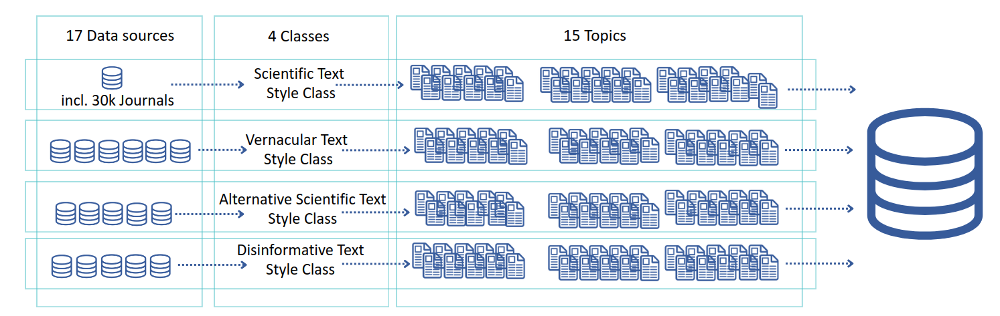
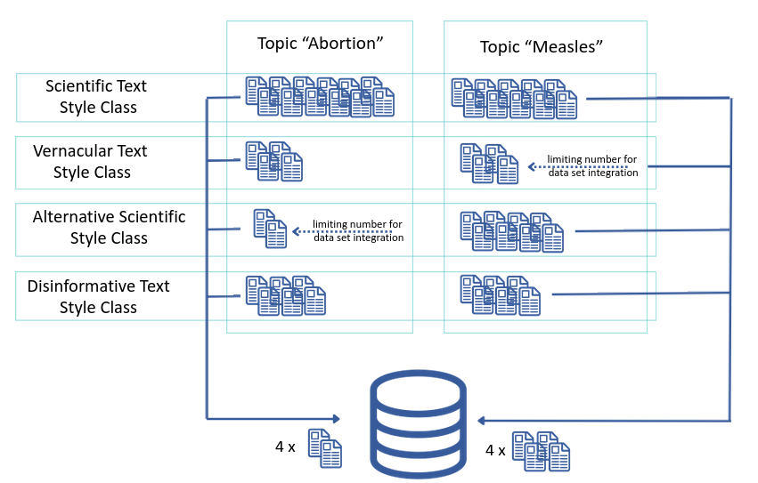

# FourShadesofLifeSciences

Project documentation on Automatic Quality Assessment NLP approach for the semantic mapping of texts in the life science
=======
# Automatic Quality Assessment: NLP approach for the semantic mapping of texts in the life science

---

## Project description
Beyond the political sphere, the proliferation of disinformation within the fields of medical and life sciences presents a significant challenge to public health. Disinformation is characterized by the incorrectness of information, as well as by the intention to spread the false information. Research attempts to address the issue of incorrectness by automating fact-checking, which comes with several difficulties when applied to research texts. 
The work presented in the article focuses on the intention rather than the fact-checking. Since disinformation follows goals such as making money, gaining attention, or discrediting a competitor, the language style is shaped by these goals. 
State-of-the-art machine learning techniques offer potential solutions to address or mitigate this issue, including methods such as text classification. The development of robust text classification methodologies requires high-quality data sets for training and evaluation. Currently, there are few comprehensive datasets for full-text life sciences with respect to disinformation. In general, the data sets focus on fact-checking short statements which refer to misinformation. To our knowledge, the approach to include the intention has not yet been addressed  by research.   
In this context, we introduce a novel labeled dataset, "Four Shades of Life Sciences". 
This categorization uniquely differentiates various levels of information accuracy beyond a simple binary distinction between disinformation and non-disinformation, enabling a more nuanced analysis based on semantic classification rather than fact-checking.
The data set was compiled in 2024. It contains a total of 2633 items.

AQUAS at [ZB MED](https://www.zbmed.de/forschen/laufende-projekte/aquas/)

## Webservice
Here you find a web serive: https://fsols.zbmed.de/

## Publications 
Soon you find our first publication here: < xx >

## Dataset
Soon you can find the data set here: < Zenodo >.

## Code
 see this repoitory: 

## Press release
[Deutsches Ärzteblatt: Künstliche Intelligenz soll Fake News bei medizinischen Informationen erkennen, 2022-12-27](https://www.aerzteblatt.de/nachrichten/139246/Kuenstliche-Intelligenz-soll-Fake-News-bei-medizinischen-Informationen-erkennen) 
[B.I.T.-online: ZB MED sagt Falschinformationen den Kampf an, 2023-01-06](https://www.b-i-t-online.de/neues/7715) 
[Fachbuchjournal: ZB MED sagt Falschinformationen den Kampf an, 2023](https://www.fachbuchjournal.de/zb-med-sagt-falschinformationen-den-kampf-an/) 
[German Circle (privater Blog), 2023-01-14](https://germancircle.blogspot.com/2023/01/aquas-gegen-falschinformationen.html) 

## Responsible
Eva Seidlmayer, Dr. phil., M.LIS  
Data Sciences and Services, Research Fellow  
ORCID: 0000-0001-7258-0532  
Mastodon: @eta_kivilih | Bluesky: @etakivilih.bsky.social  
 
ZB MED – Informations Centre for Life Sciences  
Gleueler Straße 60  
50931 Cologne  
Germany  
 
[www.zbmed.de](www.zbmed.de)  
INFORMATION. KNOWLEDGE. LIFE.

## Funding
DFG-LIS   
FO 984/6-1

## License
>>>>>>> 16abf1e4419ea0c154748f0336cf3138056dc945
Copyright (c) 2025 Eva Seidlmayer

Permission is hereby granted, free of charge, to any person obtaining a copy of this software and associated documentation files (the "Software"), to deal in the Software without restriction, including without limitation the rights to use, copy, modify, merge, publish, distribute, sublicense, and/or sell copies of the Software, and to permit persons to whom the Software is furnished to do so, subject to the following conditions:

The above copyright notice and this permission notice shall be included in all copies or substantial portions of the Software.

THE SOFTWARE IS PROVIDED "AS IS", WITHOUT WARRANTY OF ANY KIND, EXPRESS OR IMPLIED, INCLUDING BUT NOT LIMITED TO THE WARRANTIES OF MERCHANTABILITY, FITNESS FOR A PARTICULAR PURPOSE AND NONINFRINGEMENT. IN NO EVENT SHALL THE AUTHORS OR COPYRIGHT HOLDERS BE LIABLE FOR ANY CLAIM, DAMAGES OR OTHER LIABILITY, WHETHER IN AN ACTION OF CONTRACT, TORT OR OTHERWISE, ARISING FROM, OUT OF OR IN CONNECTION WITH THE SOFTWARE OR THE USE OR OTHER DEALINGS IN THE SOFTWARE.
